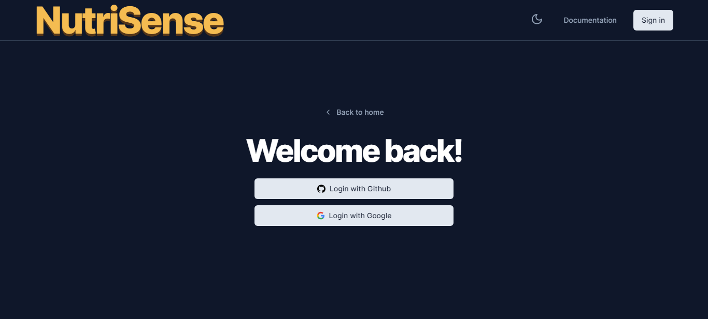
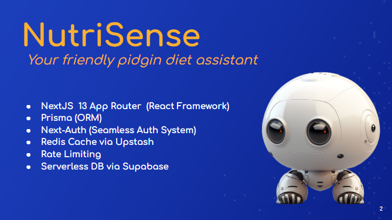

# Project Name

Nutrisense - Your friendly intelligent pidgin diet assistant


## Introduction

An AI project that utilizes the ChatGPT API but is fully customized to only respond to health and diet-related prompts. NutriSense is a web application that generates personalized diet plans based on user preferences and dietary restrictions. It uses the GPT-3 language model to generate meal plans and recipes that meet users' needs. The application is built with Next.js, Tailwind CSS, OpenAI, NextAuth and Prisma ORM.

NutriSense was inspired by a personal need for quick and healthy meal ideas. As busy professionals with busy schedules, we found it difficult to consistently make nutritious meals for ourselves and our families. We wanted a solution that was convenient, accessible, and tailored to our specific dietary needs and preferences. This project was developed as a Portfolio Project for ALX SE Program, as part of our training to become full-stack software engineers. We are proud to have developed a solution that addresses a common problem for many people, and We hope this chatbot will help others eat healthier and save time in the kitchen.

## Installation

### 1. Clone the repository

```bash
git clone https://github.com/umohpyro/nutrisense.git
```

### 2. Navigate to the project directory

```bash
cd nutrisense
```

### 3. Install dependencies

```bash
npm install
```

### 4. Create a copy of the .env.local file in the root directory and fill the configuration variables:

```bash
# ------------------------
# NextAuth.js Configuration
# ------------------------

NEXTAUTH_SECRET=secret
NEXTAUTH_URL=http://localhost:3000

# ------------------------
# OAuth Providers
# ------------------------

GOOGLE_CLIENT_ID=
GOOGLE_CLIENT_SECRET=

# ------------------------
# Database
# ------------------------

DATABASE_URL=

# ------------------------
# OpenAI
# ------------------------
OPENAI_API_KEY=

# ------------------------
# Redis
# ------------------------
REDIS_URL=
REDIS_SECRET=
```

### 5. Start the development server

```bash
npm run dev
# or
yarn dev
# or
pnpm dev
```

Open [http://localhost:3000](http://localhost:3000) with your browser to see the result.

Click on signIn to open the page below


Now log in using either Github or Google.

## Usage

-   Create an account or log in with an existing account
-   Enter your dietary preferences and restrictions
-   Click the button
-   View your personalized diet plan and recipes

## Contributing

Contributions are welcome! To contribute, follow these steps:

-   Fork the repository
-   Create a new branch

```bash
git checkout -b feature/<feature-name>
```

-   Commit your changes

```bash
git commit -m "Add some feature"
```

-   Push to the branch

```bash
git push origin feature/<feature-name>
```

-   Open a pull request

## Features



-   Rate Limited API routes
-   Protection of sensitive routes
-   Google Authentication
-   Typescript
-   A complete API key system to create & revoke user keys

-   Radix UI Primitives
-   Tailwind CSS
-   Fonts with next/font
-   Icons from Lucide
-   Beautiful dark mode with next-themes

-   Class merging with taiwind-merge
-   Animation with tailwindcss-animate
-   Conditional classes with clsx
-   Variants with class-variance-authority

## Related Projects

ChatGPT

## Feedback

If you have any feedback, please reach out to me at andemumoh@gmail.com or my partner at mercynyong@gmail.com

## License

[MIT](https://choosealicense.com/licenses/mit/)
